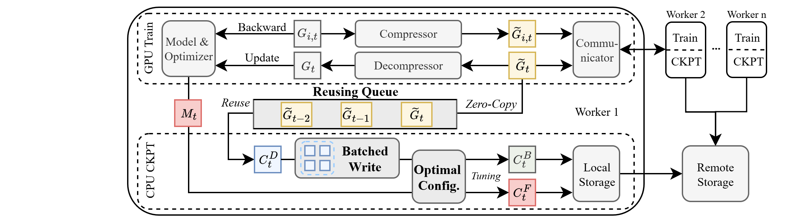

# LowDiff: Efficient Frequent Checkpointing via Low-Cost Differential for High-Performance Distributed Training Systems

## Abstract

This paper proposes LowDiff, an efficient frequent checkpointing framework that reuses compressed gradients, serving as differential checkpoints to reduce cost. Furthermore, LowDiff incorporates a batched gradient write optimization to efficiently persist these differentials to storage. It also dynamically tunes both the checkpoint frequency and the batching size to maximize the performance. Experiments on various workloads show that LowDiff can achieve checkpointing frequency up to once per iteration with less than 3.1\% runtime overhead.

## Architecture



## Setup

### Software library
- Ubuntu 22.04
- CUDA-12.4
- NCCL-2.23.4 
- OpenMPI-4.0.5 
- Python-3.10.15 
- PyTorch-2.6.0 
- Deepspeed-0.16.4

### Conda environment
``` 
conda create -n LowDiff python=3.10
conda activate LowDiff
pip install -r requirements.txt 
```

## Quick start
To run CV jobs:
```
bash ./scripts/cv_lowdiff.sh
```
To run NLP jobs:
```
bash ./scripts/gpt_lowdiff.sh
```

## Datasets
- CIFAR-100: [https://www.cs.utoronto.ca/~kriz/cifar.html](https://www.cs.utoronto.ca/~kriz/cifar.html)
- ImageNet: [https://www.image-net.org/](https://www.image-net.org/)
- Wikitex-2/103: [https://huggingface.co/datasets/wikitext](https://huggingface.co/datasets/wikitext)
- SQuAD: [https://rajpurkar.github.io/SQuAD-explorer/](https://rajpurkar.github.io/SQuAD-explorer/)

## License
See [LICENSE](https://github.com/YuchongHu/LowDiff/blob/main/LICENSE).